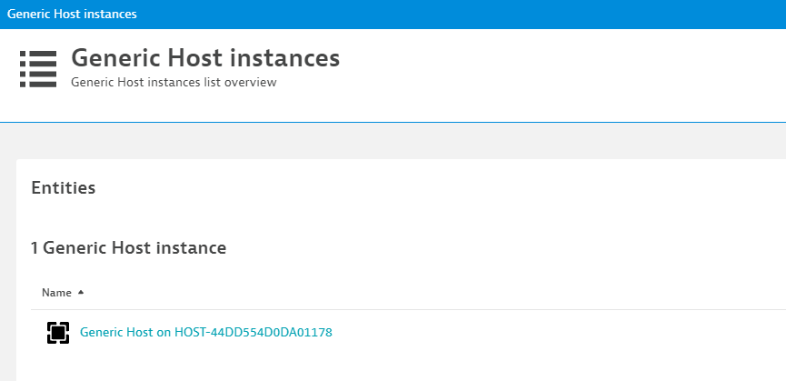
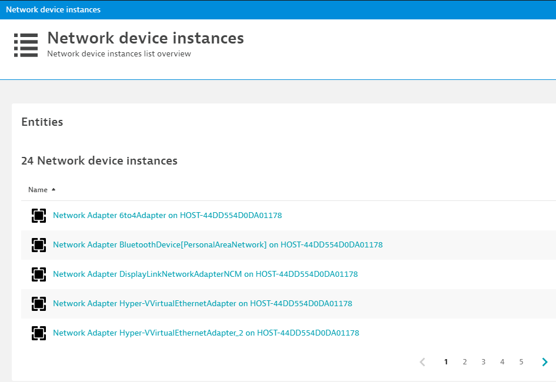

# Exercise 4 - Generic Topology
---

## Description
Having a well defined topology model helps make sense of all the metrics and data ingested in Dynatrace. 
For extensions 2.0 this all happens in the `topology` section which is split in two parts:
* `types` - defines which new entity types the extension monitors
* `relationships` - defines if and how these entity types relate to each other

**Key aspects when defining types**
* `idPattern` - must be unique enough to represent each device instance without duplicating it
* `sources` - must define rules for all metrics of the extension that should be split by this entity
  * `condition` - can make use of functions like `$prefix(...)` to define patterns for metric keys
* `attributes` - are optional details that can be extracted from the dimensions of metrics

**Key aspects when defining relationships**
* `sources` - any metric that matches the pattern will be evaluated for a relationship. This means 
it should belong to both entity types part of the relationship

**How to find your new entities**
* Navigate to `../ui/entity/list/{entity-type}` on your Dynatrace tenant. For example:
  * ../ui/entity/list/wmi:generic_host
  * ../ui/entity/list/wmi:generic_network_device

## Tasks
1. Define two entity types for a Generic Host and a Generic Network Device
2. Ensure that network devices are aware of the type (Adpater or Interface)
3. Create a relationship between the two where a Generic Network Device runs on a Generic Host
4. Package and upload a new version of your extension
5. Validate the new entities are created

## Results
You have completed this exercise when you see new entities created for your generic host and generic network device entity types:

---
## [Next exercise ▶](../5_UA-Screens)

#### [◀ Previous exercise](../3_Metric-Metadata)