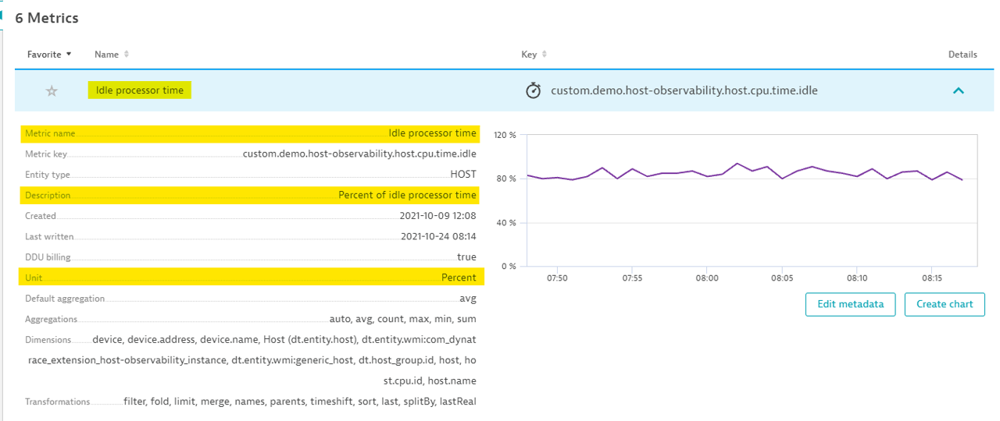

# Exercise 3 - Metric Metadata
---

## Description
With just the data source present in the extension the metric collection is rather raw - all metrics are referenced by key and everything appears without any measurement unit which can make it confusing.

The `metrics` section of the extension is there to define additional metadata for metrics. We can define the following:
* `displayName` - human readable name of metric
* `description` - what does this metric actually represent?
* `unit` - measurement unit of the metric
* `tags` - how can we easily find this metric in Metrics catalogue?
* `metricProperties`
  * `minValue` - what's the minimum possible value for the metric
  * `maxValue` - what's the maximum possible value for the metric
  * `impactRelevant` - does this metric depend on other metric anomalies to form the root cause of a Problem?
  * `rootCauseRelevant` - can this metric on its own be the root cause of a Problem?
  * `valueType` - are high values good (`score`) or bad (`error`)?

## Tasks

1. Add the `metrics` section to your `extension.yaml`
2. Define metadata for every metric collected.
3. At minimum, define `displayName`, `description`, and `unit`
4. Package and upload a new version of your extension
5. Validate metadata

## Results

You have completed this exercise when you can see the metadata reflected in the "Metrics" menu:

---
## [Next exercise ▶](../4_Generic-Topology/README.md)

#### [◀ Previous exercise](../2_WMI-DataSource/README.md)
